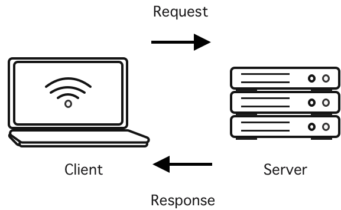
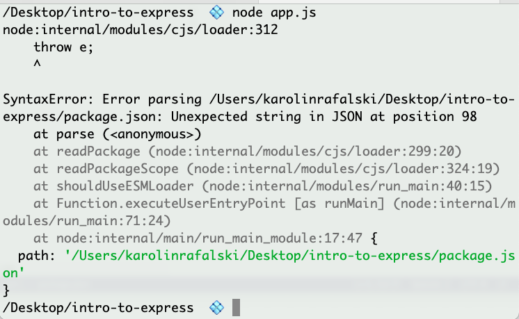

# Express Response

## Introduction

Thus far, you've built applications for the client side of the internet. Today you'll begin learning how to make servers that take requests from the client and generate responses.

Recall that when you created forms and had a user send data, it was only stored temporarily. Back-ends (with databases) will let you persistently store data. You've also used third-party APIs. Now, you'll be able to learn how to build your own API.

Remember, servers are computers that run specific software. The servers are always on; they constantly listen for requests and respond.



As a developer, you'll typically run the server on your machine and interact with it through a browser running on your machine. Eventually, you can deploy your app for anyone to use it.

## Learning Objectives

By the end of this lesson, you should be able to:

- Explain what Express is and how it fits into building a full-stack web application.
- Create a basic server using Express that locally listens for a route and responds with data to any request.
- Create a route at a specific path that responds with some data.
- Identify the role of each argument within the Express route’s callback function.
- Create an NPM script to run your server.
- Manage a running server via a terminal window.

## Introduction to building your own server

## Getting Started with Express

Take a moment to look through [the documentation](https://expressjs.com). This documentation may be difficult to use if you are new to servers. You can utilize this documentation better as you gain more knowledge and experience. Instead, you can start by looking at the [quickstart guide available on npm](https://www.npmjs.com/package/express). You can read or code along.

### Project set up

- Navigate to your Desktop or another convenient folder.
- `git status` to ensure you are not already in a `git` repository.
- `mkdir intro-to-express`
- `cd intro-to-express`
- `touch .gitignore`
- Add the following to the `.gitignore`.

```
node_modules
```

- `npm init -y`
- `npm install express@4`

Confirm that you've installed Express correctly by confirming you have a `package.json`, and in it, it has the dependency of `express`.

- `touch app.js`

Start by requiring Express. You can console log it as proof that we've pulled in a code library.

```js
// app.js
const express = require("express");
console.log(express);
```

Run this file by typing `node app.js`.

### Using Express

Now write the first `route`. The routes are like event listeners in the browser.

They will be set up to listen for requests to their specific URL.

Even though the documentation uses the `function` keyword, you can write this callback with an arrow function. In this case, it does not matter which you use. It is just a style preference.

This example will also write out `response` and `request` as parameters in our callback to help provide clarity in this first lesson. Later, you'll write your own code, and you can shorten the variables `response` to `res` and `request` to `req`.

```js
const express = require("express");
const app = express();

app.get("/", (request, response) => {
  response.send("Hello World");
});
```

Finally, turn on our app to always listen to requests. This example will use port 3003. You can typically use any port between 3000 and 9999 as long as other apps are not using them on your computer. When you put your app online, this port will be automatically configured for you, so you don't have to type it in the browser's URL when you visit your usual websites.

```js
const express = require("express");
const app = express();

app.get("/", (request, response) => {
  response.send("Hello World");
});

app.listen(3003);
```

Start this app in the terminal:

```bash
node app.js
```

This time, you'll notice that the terminal app now hangs. The cursor will be in place, and you won't get a new line prompt. This means the Express app is running and listening for requests on port 3003.

To cancel it, you have to press <kbd>control</kbd> <kbd>c</kbd>

- How do you access this route?
- What is the URL?
- What kind of response will you get?
- What data type is the response?

It would be nice to have a status that this app is running. Add a `console.log` inside a callback that will be the second argument of the function `app.listen`.

```js
const express = require("express");
const app = express();

app.get("/", (request, response) => {
  response.send("Hello World");
});

app.listen(3003, () => {
  console.log("Listening for requests on port 3003");
});
```

Neato! But how do you make a request?


You need to access `localhost` for this server. Everyone's computer has a default IP address of `127.0.0.1`, but that's a bit annoying to put in the URL. You can instead type `localhost` in the browser's URL bar and go there.

http://localhost:3003

**SUCCESS**: Do you see `Hello World` appear in the browser? Then you've successfully written your first Express server!

> **Note**: You are using the http protocol. http sends HTML, which is the datatype string. As you build your applications, it is essential to remember this, especially if you are working with other data types, such as numbers, because you will need to convert them into and out of strings.

## Common Errors

### A Broken `package.json`



Fix this by entering the `package.json` and ensuring your JSON is valid.

You can use [an online JSON Validator to check if you get stuck](https://jsonlint.com/?code=).

### Express was not properly added as a dependency


Fix it by trying to run `npm install express` again - make sure you are in the same directory as `package.json`. If you don't see a `node_modules` folder, you might have forgotten to run `npm init` first. If it is still not working, since you are so early in your project, it may be best to delete the project and start again.

## Quick Summary Before Moving On

This little app is doing a LOT!


## Nodemon

Update the route to say `Hello, world!!!!!!!!`

```js
app.get("/", (request, response) => {
  response.send("Hello, world!!!!!!!!");
});
```

When you refresh the browser, nothing changes.

You need to go to the terminal, press <kbd>control</kbd> <kbd>c</kbd>, then type `node app.js` every single time you make a change. This isn't a good workflow.

So you will install a new package called `nodemon` (short for node monitor - how you pronounce it is up for debate). Nodemon is going to monitor your app for changes to files. When it detects that you've made a change and saved it, it will automatically restart your server for you.

One more thing. You can install `nodemon` globally to work with every Node app or install it as a dev dependency for each Express project. Each strategy has pros and cons, and your instructor may prefer one approach over the other. Therefore setup for both approaches will be shown here.

### Globally install nodemon

Since you will want this for every Express app, you can install nodemon globally to use it without having to install it every single time.

In terminal run

- `npm install -g nodemon`

The `-g` means install this package globally.

- Your computer may deny you access to make this change. You can try again by running:

- `sudo !!` - This command will run the last command you typed with `sudo` in front of it.

> **Note**: `sudo` means `super user do`. It is a very powerful command. It can override a lot of safety settings on your computer. You should only use it if you know **EXACTLY** what you are doing. Improper use can turn your MacBook into a brick that can only be fixed by taking it to Apple (they have the technology to recover your computer back to factory state, but you may lose all your work that was not backed up).

Your computer will likely ask you for your computer login password. The UI is not great - when you type, there is no feedback on how many characters you have typed. Press enter when you've entered your password. If you've gotten your password wrong, rerun the above terminal command by pressing the up arrow.

Once you are set up, you can now start your server by typing:

- `nodemon app.js`

Now you should be able to change your message in your `res.send` to ("Hello, Express"), and when you refresh the browser, it should change automatically. You can see `nodemon` giving you messages in the terminal that it is restarting.

<details><summary>Mini BONUS with nodemon</summary>

Is typing `nodemon app.js` just too much? You can go into your `package.json` and update the property of `main` to `app.js` instead of the default `index.js`.

Now you can type just `nodemon` and start your server!

</details>

## Install nodemon and run as a dev dependency

Alternatively, if you do not want to install nodemon globally, add it as a dev dependency and update your `package.json`. It is essential to save it as a dev dependency because only developers need it to build an application. It will not be used to run your app if you end up deploying it to the web.

`npm install nodemon@2 --save-dev`

Then in `package.json`

```json
 "scripts": {
 "dev": "nodemon app.js"
 }
```

Then, to run your app, type:

- `npm run dev`

## Adding Another Route

Let's add another route.

```js
const express = require("express");
const app = express();

app.get("/", (request, response) => {
  response.send("I love Express!");
});

app.get("/universe", (request, response) => {
  response.send("Hello Universe!");
});

app.listen(3003, () => {
  console.log("I am listening for requests on port 3003!");
});
```

To access this next route, you will go to http://localhost:3003/universe

## grep and kill nodemon

Suppose you don't cancel out of your server properly before putting your computer to sleep or try to run nodemon on the same port multiple times. In that case, you may have `nodemon` running amok in your background processes.

You have two options: you can restart your whole computer, or you can kill the process.

To kill the process, first, you must find the process. To do so, you'll run the command `ps` (short for process status) and the flag `-A` (all).

You will then use pipe `|` to use `grep` (global regular expression print) to search for `nodemon` specifically.

- `ps -A | grep nodemon`


On the left, you will see the process number. In this case, it is `26625`. Now you can kill the process by typing:

- `kill 26625`

Get into good habits of gracefully exiting out of programs to avoid taking extra troubleshooting steps like the ones above.

### An aside about newer JS syntax

You may have seen other JavaScript applications use `import` and `export`. This unit will use CommonJS (`require` and `module.exports`) for back-end applications and ESM modules `import` and `export` for the front-end applications. Express 4.x and several other packages you'll be using in this unit are still set up as CommonJS modules (Summer 2023). It would take extra configuration to get them up and running. For ease of learning, you will stick with CommonJS. Additionally, you will likely see both CommonJS and ESM modules on the job or when you look at coding examples. Therefore having experience with both will probably be beneficial.
