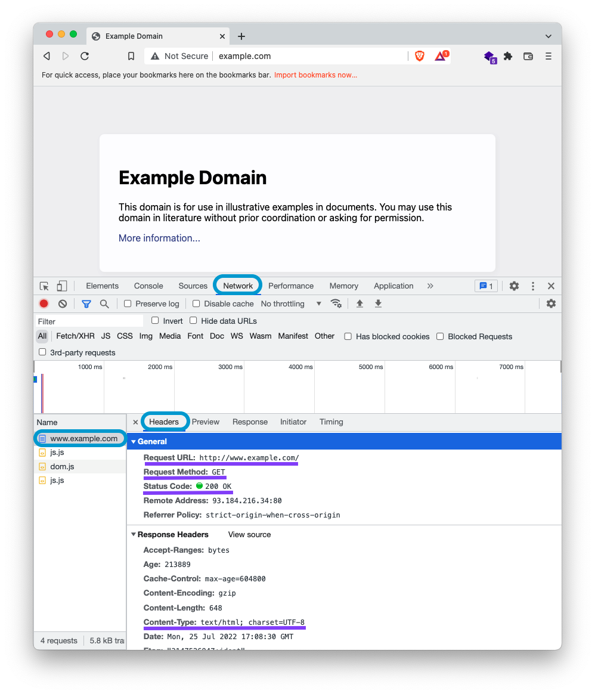

# Intro to the Internet and Servers

## Introduction

Typically, when software engineers begin learning about the internet, they start with the front-end of a website and spend less time focusing on the back-end. In this unit, you will focus on back-end and full-stack web development.

The back-end of an application is made up of servers and databases. Without a robust back-end application, a front-end application is only capable of statically displaying information. While it can be interactive for a user, it cannot store data or handle unknown requests. In this lesson, you will learn how these two sides of applications interact with one another.

## Learning Objectives

By the end of this lesson, you should be able to:

- Define clients, servers, and databases.
- Define the basic components of the internet.
- Describe the request-response cycle.
- Identify the key components of an HTTP request.
- Identify the key components of an HTTP response.

---

## Components of the internet

In order to learn how to build a back-end, it is helpful to understand the basics of the internet and the request-response cycle.

The internet is made up of many different elements. Most of these components are abstracted away from your day-to-day experience of the internet. People rarely consider the components described in this reading when they use the internet. However, as a software developer, you need to know some fundamentals about how the internet works.

### Computer networks

Computer networks allow the connection of two or more computers to exchange and share data and other resources.

Computer networks are everywhere. Within your home or building, you may have many devices that connect to a router, usually to allow the devices access to the internet. A library is another place with several computers connected to a network. The library may also have a copier available on its network. When you are on the library network, it is possible to access and use the copier through the network.

Computer networks can be set up by location, like a company office, metropolitan area, or global network.

### The internet and the web

The internet is a global computer network that uses the Internet protocol suite (TCP/IP). It is a network that includes public and private networks, like schools, businesses, and government networks.

A protocol is an agreed-upon official set of rules. Protocols allow for consistent and predictable procedures, which in turn allow for easy adaptation across systems.

People often use the terms _the internet_ and _the web_ interchangeably. The world wide web is a subset of the internet (also referred to as _www_ or _w3_ or _the web_). The web can be accessed through a _web browser_ like Chrome, Firefox, or Safari. Websites part of the world wide web often have a URL that starts with `www`.

## Components of a request-response cycle

Computers connected to the web fall into two categories: clients and servers.

- _Clients_ make _requests_ to _servers_
- _Servers_ make _responses_ to _clients_

Here is a simplified diagram of how they interact:


### Client

A client is anything that connects to the internet and makes _requests_ to servers. Think about the last time you used the internet outside of class. You may have:

- Requested weather data from a weather website.
- Checked the time your favorite coffee shop opens.
- Looked up the price of a flight.
- Shopped for a gift.
- Confirmed an appointment.
- Used an app to turn off the lights in your home.

Each of these activities involves a client (you and your phone/laptop) making requests to a server and getting responses from the server with some information.

### Server

A server is just a computer that can receive _requests_ and _respond_ to those requests.

You can make your computer into a server. But for other computers to make requests to it, it would have to be on all the time for uninterrupted service. Additionally, if your app becomes very popular, your laptop will not be able to handle the usage because it was not designed for this as a primary purpose. Instead, there are dedicated computers that are servers.

Here is an image of a server farm that is full of computers that are servers:


There are several types of servers. Some examples are:

- **Web server**: Serves web pages through web browsers.
- **Email server**: Facilitates sending and receiving email messages.

### Databases

A database is a computer program that stores electronic data in organized collections. Its only job is to manage data. For example, when you sign-up for a new service, your email and password are stored in that service's database.

A server contains the logic that manages how a client accesses and interacts with the data.

For example, a shopping website may store an account with information like your name, address, and credit card in a database. You can view your information through the website's front-end application but cannot access someone else’s data. Your direct interaction is with the server through the web browser. The browser sends your request to the server, and the server interacts with the database, responding with information that is displayed in the front-end application.


## Requests and responses

In order to build web applications you will use _HTTP_.

HTTP stands for HyperText Transfer Protocol. It is helpful to remember that HTML stands for Hyper-Text Markup Language. The initial purpose of the HTTP protocol was to transfer HTML. Over time it has extended to allow the transfer of JSON, images, and several other types of data.

Requests and responses are sent via HTTP. The requests are sent to an address represented by a URL.

### URL Components

URLs are addresses of computers and resources on the internet. Requests and responses use these addresses to find one other.

URL stands for Uniform Resource Locator. It's a string of text characters that are formatted in a uniform manner. Web browsers (and other software) use these strings to help locate where to send requests and find resources.

You can see a URL in the browser. Usually, the URL bar is along the top:


Let's break down the contents of a more complex URL:

```
 https://www.example.org:3000/hello/world/index.html?name=foo&limit=20#footer
 \___/ \_______________/ \__/ \___________________/ \_______________/ \____/
protocol  host/domain    port         path            query-string  hash/fragment
```

The URL components are always in the same order.

| Element          | About                                                                                                                                                                                                                                                                                                                                                                                                      |
| ---------------- | ---------------------------------------------------------------------------------------------------------------------------------------------------------------------------------------------------------------------------------------------------------------------------------------------------------------------------------------------------------------------------------------------------------- |
| protocol         | The application protocol in this example is HTTP or HTTPS (`S` stands for secure). Other familiar types of application protocols include SMTP/POP, and SSH.                                                                                                                                                                                                                                                |
| host/domain name | The server's name that provides the resource.                                                                                                                                                                                                                                                                                                                                                              |
| port             | A server can have multiple ports. Multiple ports allow users to access different applications on the same host. The port is usually pre-configured, so it typically does not need to be included in the URL to locate a resource.                                                                                                                                                                          |
| path             | Web servers can organize resources into a system similar to files and folders in directories.                                                                                                                                                                                                                                                                                                              |
| query-string     | The client can pass parameters to the server through the query-string. The query-string allows for additional request information to be passed through the URL. For example, if you go to an international website, it may have `lang=en`, which means respond with a web page in English.                                                                                                                 |
| hash/fragment    | The client can use a hash/fragment to identify some portion of the content in the response. If you click on an element in the table of contents on this page, the page will scroll down to that section and you will see a hash fragment in the URL corresponding to the section. If you send your friend the link with the hash fragment the page will load and automatically scroll down to the section. |

### HTTP Protocol

The HTTP protocol always starts with a _request_. For every _request_, there can be one and only one _response_.

We can make four common requests, which correspond to four primary ways we typically want to interact with data.

- **POST**: _**C**reate_ data, make a new user account
- **GET**: _**R**ead_ data, see details of the user account
- **PUT/PATCH**: _**U**pdate_ data, make changes to the user account
- **DELETE**: _**D**estroy_ data, delete the user account

These four ways of interacting with data are often referenced as CRUD. CRUD is an acronym for _create_, _read_, _update_, and _destroy_.

HTTP primarily sends data as strings. It has two main parts: A _header_ and a _body_.

### Header

The header contains essential data about requests and responses. You can think of it as metadata for requests and responses.

"Metadata is data about other data. An example is when you have a digital photograph, the image is one kind of data. Additionally, there will be metadata for the photograph, which may include the time the image was taken and the location. The metadata is not seen on the image, but can be accessed in other ways. "

Some examples of the information included in a header of a request are:

- **URL**: The location from where the request was made.
- **Method**: The type of request being made.

Some examples of the information included in the header of a response are:

- **Content-Type**: The type of data allowed. It can be plain text, HTML, JSON, or other files like images or videos.
- **Status Code**: A numerical code that describes the response.

You can view headers sent by opening your browser’s dev tools, going to the Network tab, and selecting a file.

<!-- TODO An overlay on this image highlighting what part of the request is and what is part of the response would be great. -->



When a request or response is sent, a header is always required.

### Body

The body is an optional part of both the HTTP request and response. The body contains data or content.

For example, a request body might include the data that a user inputted into a form. A response body could consist of the HTML content for your browser to render on the page.

### HTTP Status Codes

HTTP Status Codes help convey information about responses. For example, was the response successful? Or did it fail? If it failed, why? Was it a user error or server error, or something else?

The status codes from 100 - 399 generally confirm that the request/response is OK.

The 400s typically denote user error, like trying to access a part of a site without logging in (403) or accessing a web page that does not exist (404).

The 500s typically denote a server error. For example, the server has crashed.

For a memorable introduction see [HTTP Status cats](https://http.cat/), or if you would prefer [HTTP Status Dogs](https://httpstatusdogs.com/).
