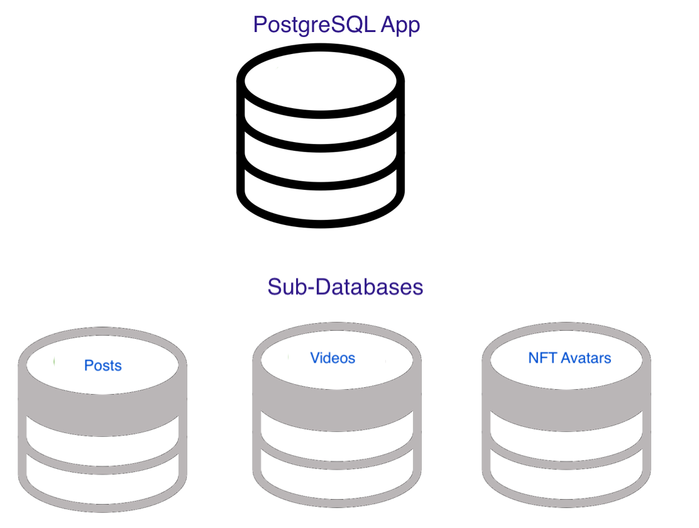
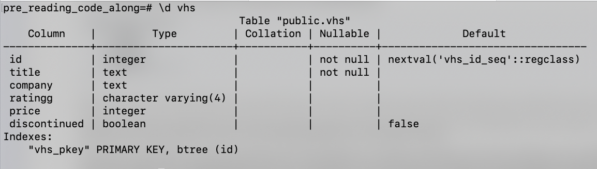

# Intro to Databases/SQL

## Introduction

A database is an organized collection of data stored and accessed electronically.

You've been hard-coding some data for your CRUD apps to learn the fundamentals of servers and RESTFul routes. You could make some temporary changes, but the changes would disappear as soon as you shut down or restarted the server.

You need a way to make the data persist so that you will still have the data if the server is restarted or shut down. You'll use a database to store and access data.

There are many kinds of databases. A common type is a relational database, which stores data in tables and rows like an Excel or Google spreadsheet. You will interact with relational databases using a coding language called SQL (Structured Query Language). Some popular ones are MySQL, Oracle, SQL Server, SQLite, and PostgreSQL.

While a Google sheet can hold hundreds or thousands of records, it isn't meant to hold millions or billions of records (think about a database that contains all the user data of FaceBook). Additionally, you can relate different tables (sheets), allowing you to do powerful things with data.

You'll be working with [PostgreSQL](https://www.postgresql.org/docs/current/intro-whatis.html) (a successor to a database called `ingres`), an open-source RDBMS (relational database management system) created at the University of California Berkeley. It started being built in 1982. You can access the [official documentation here](https://www.postgresql.org/docs/current/index.html).

The [skeuomorphic representation of a database](https://en.wikipedia.org/wiki/Skeuomorph) is a stack of disks:


## Lesson Objectives

After this lesson, you should be able to:

- Define databases and their role in a full-stack app
- Explain what kind of database PostgreSQL is
- Differentiate between data definition language (DDL) and data manipulation language (DML).
- Connect to the `psql` shell via the command line.
- Perform common commands in the `psql` shell.
- Set up and drop (delete) a (sub) database
- Perform the following actions with tables:
- Create a table, and set columns with
  - datatypes
  - constraints
- Alter the table.
- Drop the table.
- Perform the following actions with table data:
  - **C**reate a row and put it into the table (insert data)
  - **R**ead from the table (query data)
    - Filter data using the `WHERE` clause.
  - **U**pdate from the table
  - **D**elete from the table
- Write more complex queries that:
  - Limit
  - Sort
  - Aggregate

---

#### DDL and DML

When learning and communicating about a particular technology, learning the terminology to understand and share ideas is essential. Two terms are helpful to know as you learn about databases.

DDL (Data Definition Language) - All statements will involve defining the data (working with the data tables). You can remember this by the mnemonic device DR.CAT.

- Drop (a table)
- Rename(a table)
- Create (a table)
- Alter (a table)
- Truncate (a table)

DML (Data Manipulation Language)- All statements involve manipulating the data within a table. You can remember this by the mnemonic device SUDI.

- Select
- Update
- Insert
- Delete

Can you figure out which actions are related to each CRUD action in both DDL and DML?

> **Note**: [Truncate](<https://en.wikipedia.org/wiki/Truncate_(SQL)>) a table means resetting all the data in the table. In some definitions, it is related to DML; in others, it is associated with DDL. Why is this particular action seen as part of DDL or DML?

## Getting Started

You should have already downloaded PostgreSQL at the start of this course. [Pursuit Core Environment Set Up](https://github.com/pursuit-curriculum-resources/guide-computer-setup/tree/main/postgresql).

It should already be running, and you should see an icon of an elephant in your Mac's bar.


If you don't see it, but you've installed it, use Mac's `spotlight` search feature: <kbd>command</kbd> <kbd>spacebar</kbd> to search and load it.


You can configure PostgreSQL to always load on startup and stop/start your server from the icon.


Today, you're going to use the PostgreSQL shell in the Terminal. To launch it, go _anywhere_ in the Terminal and type:

- `psql`


## SQL Syntax

Even though keywords in SQL are not case-sensitive, the convention is to capitalize them.

```SQL
-- correct
SELECT * FROM bookmarks;

-- incorrect
select * from bookmarks;
```

**Note:** Comments start with two dashes `--`.

## SQL's big syntax gotchas

Postgres in the Terminal gives you some cues about whether your previous command is complete or if it had an error, but they can be hard to spot as a new user.

A prompt ready to go is preceded by `=#`.


Semi-colons are required to end your statement. If you forget your semi-colon, the prompt will drop to the following line and appear as a `-#`.


To fix this, add a semi-colon and press <kbd>return<kbd>


You will see similar prompt changes if you don't close your quotes properly.

Another thing that can happen is that you get a lot of rows of data back, and you may not want to scroll through them all. To `q`uit that view, press `q`.

You'll see a colon that will let you know there is more data, which you can use the down arrow to scroll through or press `q` to get your prompt back.


## Create a Database

PostgreSQL is a database application. When you run the application, you can create `sub-databases` that allow you to work on different projects. For example, you may have one for your bookmarks app, one for your budgeting app, and more. These are sub-databases. However, they are often referred to as `databases`, and you use the keyword `DATABASE` to create them.



Feel free to read or code-along with the following examples.

Create a database and then drop (delete) it. Then create a new one, connect it, and use it for the rest of this pre-reading.

```SQL
-- Create the sub-database second
CREATE DATABASE first;

-- drop it
DROP DATABASE first;

-- Get started with this code along
CREATE DATABASE pre_reading_code_along;

-- connect to the pre_reading_code_along sub-database
\connect pre_reading_code_along;

-- OR (does the same thing as connect, just shorthand)
\c pre_reading_code_along;
```

## Data types

With JavaScript, you could play it fast and loose with datatypes when creating data as arrays of objects. You could enter the number 4 as `4` (datatype number) or `'4'` (datatype string). You could also put different datatypes, like booleans or arrays into a field; JavaScript doesn't enforce datatypes.

PostgreSQL is more strict and expects the correct data types in the columns you will create. Here are some of the most common ones:

1. `INT` - [Whole number](https://www.postgresql.org/docs/current/datatype-numeric.html)
1. `DECIMAL` - [float/decimal](https://www.postgresql.org/docs/current/datatype-numeric.html)
1. `BOOL` - [boolean](https://www.postgresql.org/docs/current/datatype-boolean.html)
1. `VARCHAR(n)` - [Set character limit](https://www.postgresql.org/docs/current/datatype-character.html)
1. `TEXT` - [No character limit (text size up to 1GB)](https://www.postgresql.org/docs/current/storage-toast.html)
1. `TIMESTAMP` - [date](https://www.postgresql.org/docs/current/datatype-datetime.html)
1. `SERIAL` - [serial, automatically increments as new rows are created](https://www.postgresql.org/docs/current/datatype-numeric.html#DATATYPE-SERIAL)

Thought question: Why is it important or useful to set and enforce a datatype for a field?

## Create a table

Inside a database, you can have many tables. You'll create a table of DVDs for sale. If you were working for an online DVD store, you'd have additional tables for users, orders, and more. For this lesson, you'll only work on one table. In a later lesson, you'll learn how to work with two or more tables.

Tables have columns and rows. To create a new table, you will define the names of the columns and their datatypes.

The following table has just one column called `name` with a datatype of `TEXT`. You can drop it immediately, as this is just a demonstration of the syntax.

```SQL
-- Describe your tables
CREATE TABLE first ( name TEXT ); -- create a table called 'first' with one column called 'name', which is a text column

-- see table
\dt

-- Drop a table
DROP TABLE first;

```

> **Note**: It is critical that you do not name your table the same name as the database because you will get a [namespacing](https://en.wikipedia.org/wiki/Namespace) error. In the above case, you should have dropped your database first and created and connected to a new one called `pre_reading_code_along`.

### Designing a table

For the online DVD store, let's assume you would want the following data:

- `id` - SERIAL PRIMARY KEY
- `title` - TEXT
- `company` - TEXT
- `rating` - VARCHAR(4)
- `price` - INTEGER
- `discontinued` - BOOLEAN

You need to determine the datatype for each column. Additionally, you want to add some [constraints](https://www.postgresql.org/docs/current/ddl-constraints.html).

You want the `id` to increment as you add a new DVD automatically. You can create an automatically incrementing value using the datatype `SERIAL`. Additionally, adding `PRIMARY KEY` will create a constraint that this cell cannot be null and must have a unique value.

Additionally, there is no sense in having a DVD without a title. So that field must always have a value. To add a constraint that this value cannot be null, you add the key words `NOT NULL`.

Ratings can be a single letter like `G` or four letters like `PG13`. Limiting the characters can help keep the data consistent since only `G` can be entered, rather than the full word `General`. You can limit the number of characters by using the datatype `VARCHAR(n)`.

Price can be set as an integer set in cents. You can easily convert it into and out of a dollar amount with JavaScript. You don't want to allow a negative price so you can use the constraint `CHECK (price >= 0 )`.

Finally, you can expect that most VHS tapes are still in print. However, sometimes they may be discontinued. Therefore, setting a `DEFAULT` value of false if the user doesn't enter a value can be prudent.

```SQL
-- Note `ratingg` is not a typo in this case. You will update it to `rating` in a later section.

CREATE TABLE
 VHS
 ( id SERIAL PRIMARY KEY, title TEXT NOT NULL, company TEXT, ratingg VARCHAR(4), price INT, discontinued BOOLEAN DEFAULT false, CHECK(price >= 0));

-- Show description of columns for the table VHS
\d VHS;
```



### Alter a table

You can make changes to the table you've created.

**IMPORTANT:** You cannot roll back changes or undo deletes with a PostgreSQL database. When working in production, be sure to have backup systems in place.

```SQL
-- Add a test column
ALTER TABLE VHS ADD COLUMN test TEXT;

-- Drop the test column
ALTER TABLE VHS DROP COLUMN test;

-- Rename a column
ALTER TABLE VHS RENAME ratingg TO rating;

-- Rename a table
ALTER TABLE VHS RENAME TO dvds;
```

```SQL
\d dvds
```

## Insert into the table

You don't have to remember the order of the columns you created, but you have to match the order when inserting data into the table.

```SQL
INSERT INTO
 dvds (title, discontinued, price, rating, company)
VALUES
('Hackers', TRUE, 100, 'PG13', 'United Artists');
```

A successful message will look something like the following:

```SQL
INSERT 0 1
```

You can see the data by doing a query. The `*` (star) means to show all the columns.

```SQL
SELECT * FROM dvds;
```

You don't have to enter all the fields (only the required ones).

```SQL
INSERT INTO
 dvds (title)
VALUES
('Tron');
```

Remember, you can use the `up` arrow in the Terminal to scroll to previous commands to easily rerun a command.

```SQL
SELECT * FROM dvds;
```

Let's add some more DVDs (copy-paste from the notes into your Terminal):

```SQL
INSERT INTO
 dvds (title, company, rating, price, discontinued)
VALUES
 ('Imitation Game', 'Black Bear', 'PG13', 12, false),
 ('Matrix', 'Warner Bros', 'R', 4, null ),
 ('Tetris', 'Apple', 'R', 19, null),
 ('2001: A Space Odyssey', 'Stanley Kubrick Productions', 'G', 150, true),
 ('Hidden Figures', 'Fox 2000', 'PG', 25, false);
```

### Select from the table

Here, we can explore some powerful queries we can make using SQL.

```SQL
-- Select all rows from the DVD's table. display only the title column
SELECT title FROM dvds;

-- Select all rows from the DVDs table. Display only the title and rating column
SELECT title, rating FROM dvds;

 -- Select all rows from the DVD's table. display only all the columns
SELECT * FROM dvds;

-- Select all rows from the DVDs table where the company column is set to 'Apple'
SELECT * FROM dvds WHERE company = 'Apple';

-- Select all rows from the DVDs table where the rating column is set to 'pg' or 'Pg' or 'PG' (case insensitive)
SELECT * FROM dvds WHERE rating ILIKE 'pg';

-- Select all rows from the DVDs table where the rating column contains 'PG'
SELECT * FROM dvds WHERE rating LIKE '%PG%';

-- Select all rows from the DVDs table where the company column is set to 'Apple' AND the rating column is set to 'R'
SELECT * FROM dvds WHERE company = 'Apple' AND rating = 'R';

-- Select all rows from the DVDs table where either the discontinued column is set to TRUE, OR the company column is set to 'Apple'
SELECT * FROM dvds WHERE discontinued = TRUE OR company = 'Apple';

-- Select all rows from the DVDs table where the price is set to 100
SELECT * FROM dvds WHERE price = 100;

-- Select all rows from the DVDs table where the price column is not set to 100
SELECT * FROM dvds WHERE price != 100;

-- Select all rows from the DVDs table where the price column is greater than 25
SELECT * FROM dvds WHERE price > 25;

 -- Select all rows from the DVDs table where the price column is less than 25
SELECT * FROM dvds WHERE price > 25;

-- Select all rows from the DVDs table where the price column is greater than or equal to 25
SELECT * FROM dvds WHERE price >= 25;

-- Select all rows from the DVDs table where the price column is less than or equal to 25
SELECT * FROM dvds WHERE price >= 25;

-- Select all rows from the DVDs table where the price column is null
SELECT * FROM dvds WHERE price IS NULL;

-- Select all rows from the DVDs table where the discontinued column has a value
SELECT * FROM dvds WHERE discontinued IS NOT NULL;

```

## Update a row and return the new value

> **NOTE**: DANGER! Forgetting the `WHERE` clause for UPDATE or DELETE can cause every row to update/delete.

```SQL
UPDATE dvds SET discontinued = TRUE WHERE id = 7;
```

Typically actions like creating a new item or updating and deleting an item don't return any rows.

However, sometimes you want to see the changes you made. We can add a `RETURNING` statement. This saves you from making a follow-up query if you want that data.

```SQL
UPDATE dvds SET company='Disney' WHERE id = 2 RETURNING *;
```

## Delete a row

```SQL
DELETE FROM dvds WHERE id = 1;
```

## Delete many rows and see the titles and companies

You can create more complex queries, using the syntax you've already learned.

```SQL
DELETE FROM dvds WHERE discontinued = false RETURNING title, company;
```

## Quit PostgreSQL shell

To quit `psql`, type `\q`.

## Additional actions

Below are a few more things you can do with SQL. You don't have to learn all of this in one day. However, it should serve as a useful reference.

### Limit

The data set is very tiny right now. If you were to imagine a shopping site, you usually don't want to load hundreds or thousands of products simultaneously. It would be very slow and typically unnecessary.

You can limit how many rows to get back.

```SQL
-- Select all rows from the DVDs table, but show only the first row
SELECT * FROM dvds LIMIT 1;
```

### Offset

If you were to imagine pagination for your store, you would also want to offset (start at a later row) the data on upcoming pages.

```SQL
-- For comparison to the next one
SELECT * FROM dvds;
-- Select all rows from the DVDs table, but show only one row. Skip the first row
SELECT * FROM dvds LIMIT 1 OFFSET 1;

```

### Sorting

It's essential not to rely on the order you put in the database for sorting. When you need to sort your data, do so with specific SQL commands.

```SQL
-- Select all rows from the DVDs table, order by name alphabetically
SELECT * FROM dvds ORDER BY title ASC;

-- Select all rows from the DVDs table, order by name reverse alphabetically
SELECT * FROM dvds ORDER BY title DESC;

-- Select all rows from the DVDs table, order by price ascending
SELECT * FROM dvds ORDER BY price ASC;

-- Select all rows from the DVDs table, order by price descending
SELECT * FROM dvds ORDER BY price DESC;
```

### Combination

Combining statements takes a bit of thought and practice. It is also important to note that `SELECT/FROM` comes first, then `ORDER BY`, then `LIMIT` and `OFFSET` clauses. If you try to reorganize these components, you will get a syntax error.

```SQL
SELECT title, rating, price FROM dvds ORDER BY rating, price ASC LIMIT 2 OFFSET 2;
```

### Counts and aggregation

```SQL
-- show the total number of DVDs.
SELECT COUNT(price) FROM dvds;

-- Divide all rows into groups by company and rating. Show the number of rows in each group. Also, show the company and rating of each group
SELECT COUNT(*) title, company, rating FROM dvds GROUP BY company, rating;

 -- Show the SUM of all the DVD prices.
SELECT SUM(price) FROM dvds WHERE price IS NOT NULL;

 -- Show the SUM of all the DVD prices where the discontinued is true
SELECT SUM(price) FROM dvds WHERE discontinued IS TRUE;

-- Divide all rows into groups by whether or not they are for sale. Show the AVG of the price of each group. Also, show the property of each group
SELECT AVG(price) FROM dvds GROUP BY rating;

-- show the MIN price of DVDs.
SELECT MIN(price) FROM dvds;

-- Show the MAX and group them.
SELECT title, rating, MAX(price) FROM dvds GROUP BY title, rating;

```

### Extra Reading

A little about databases and the value null: [Hello, My Name is Mr. Null](https://www.wired.com/2015/11/null/)

If you have worked with databases before, it might be interesting to go a bit deeper into some key features of PostgreSQL.

It is [ACID-compliant](<https://en.wikipedia.org/wiki/ACID_(computer_science)>) and [transactional](https://en.wikipedia.org/wiki/Transaction_processing)
