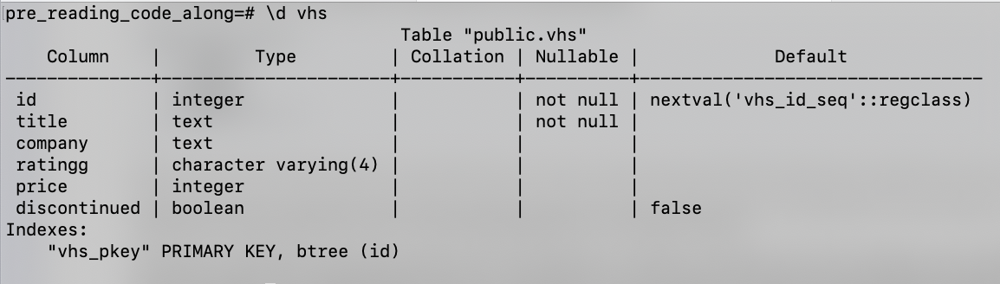

# Intro to Databases/SQL Part 1

## Lesson Objectives

- Define databases and their role in a full-stack app
- Introduction to PostgreSQL
- Set up and drop (delete) a (sub) database
- Create a table, set columns, and drop the table
- **C**reate a row and put it into the table (insert data)
- **R**ead from the table (query data)
- **U**pdate from the table
- **D**elete from the table
- Bonus: Limit, Sorting, and Aggregation

## Introduction

- What is a Database?

### Getting Started

You should have already downloaded PostgreSQL at the start of this course. [Pursuit Core Environment Set Up](https://github.com/pursuit-curriculum-resources/guide-computer-setup/tree/main/postgresql)

The application should already be running. You should be able to enter the Postgres shell by typing:

- `psql` anywhere in Terminal.

## SQL Syntax

Which is the correct convention for SQL keywords?

```sql
-- first
SELECT * FROM bookmarks;

-- second
select * from bookmarks;
```

Will you get an error if you don't capitalize correctly?

**Note:** Comments start with two dashes `--`

## SQL's Big GOTCHAS

- What status does the following prompt let you know?


- What status does the following prompt let you know?


- How can you fix this prompt back to a ready state?

- How do you quit out of a view with lots of data?


## Create a Database

Let's create a database and then drop (delete) it. Then we'll create a new one, connect it, and use it for the rest of this lesson.

```SQL
-- create the sub-database foo
CREATE DATABASE foo;

-- drop it
DROP DATABASE foo;

-- get started with our code along
CREATE DATABASE lesson_db;

-- connect to the lesson_db sub database
\connect lesson_db;

-- OR (does the same thing as connect, just shorthand)
\c lesson_db;
```

## Data types

Here are some of the most common datatyes for PostgreSQL. Define what each one is

1. `INT`
1. `DECIMAL`
1. `BOOL`
1. `VARCHAR(n) `
1. `TEXT`
1. `TIMESTAMP`

## Create a Table

Inside a database, we can have many tables. We'll create a table of houses for sale. If we were working for a real estate company, we would have separate tables for buyers, agents, commercial properties, etc.

Tables have columns and rows. We will define the names of the columns and their data types.

```SQL
-- describe your tables
CREATE TABLE foo ( name TEXT ); -- create a table called 'foo' with one column called 'name', which is a small text column

-- see table
\dt

-- drop a table
DROP TABLE foo;

-- 'houses' table has an id column `serial`, a number that increases with each addition, and columns for address, city, state, price, and boolean properties for pool and for_sale.

CREATE TABLE
 homes
 ( id serial, address TEXT NOT NULL, city TEXT, st varchar(2), price INT, pool BOOLEAN DEFAULT false, for_sale BOOLEAN);

-- show description of columns for the table houses
\d homes;
```

- What is the purpose of the `id` field?



### Alter a Table

You can make changes to the table you've created.

**IMPORTANT:** You cannot roll back changes or undo deletes with a PostgreSQL database. When working in production, be sure to have backup systems in place.

```sql
-- rename a table
ALTER TABLE homes RENAME TO houses;

-- add a test string column
ALTER TABLE houses ADD COLUMN test TEXT;

-- drop the test column
ALTER TABLE houses DROP COLUMN test;

-- rename a column
ALTER TABLE houses RENAME st TO state;

```

See the columns in the house's table again.

```sql
\d+ houses
```

## Insert Into The Table

You don't have to remember the order of the columns you created, but you have to match the order when inserting:

```SQL
INSERT INTO
 houses (address, pool, price, state, city, for_sale)
VALUES
('99 Sunnyside Drive', TRUE, 100, 'NY', 'Springfield', true);
```

- How can you see the data in your table?

- What does the `*` (star) mean?

```SQL
SELECT * FROM houses;
```

Create a new row:

```SQL
INSERT INTO
 houses (address)
VALUES
('Graceland');
```

Remember, you can use the `up` arrow to scroll to previous commands to run.

```SQL
SELECT * FROM houses;
```

Let's add some more houses (copy-paste from the notes into your terminal):

```SQL
INSERT INTO
 houses (address, city, state, price, pool, for_sale)
VALUES
 ('2 Maple Court', 'Monroe', 'NY', 200, false, true),
 ('50 Beech Street', 'Bacon', 'IN', 75, null , null),
 ('101 Willow Avenue', 'Twin Peaks', 'WA', 300, null, null),
 ('2300 Orchard Lane', 'Monroe', 'NC', 150, null, true),
 ('57 Sycamore Boulevard', 'Monroe', 'CT', 275, false, false),
 ('88 Hemlock Grove', 'Eek', 'AK', 200, true, true),
 ('109 Pine Drive', 'Happyland', 'CT', 220, false, null);
```

### Select from the table

Here, we can explore some powerful queries we can make using SQL.

```SQL
-- select all rows from the house's table. display only the address column
SELECT address FROM houses;

-- select all rows from the house's table. Display only the address and state column
SELECT address, state FROM houses;

 -- select all rows from the house's table. display only all the columns
SELECT * FROM houses;

-- select all rows from the house's table where the name column is set to 'Monroe'
SELECT * FROM houses WHERE city = 'Monroe';

-- select all rows from the house's table where the name column is set to 'ny' or 'Ny' or 'NY' (case insensitive)
SELECT * FROM houses WHERE state ILIKE 'NY';

-- select all rows from the house's table where the name column contains 'Drive'
SELECT * FROM houses WHERE address LIKE '%Drive%';

-- select all rows from the house's table where the city column is set to 'Monroe' AND the state column is set to 'CT'
SELECT * FROM houses WHERE city = 'Monroe' AND state = 'CT';

-- select all rows from the house's table where either the pool column is set to TRUE OR the city column is set to 'Twin Peaks'
SELECT * FROM houses WHERE pool = TRUE OR city = 'Twin Peaks';

-- select all rows from the house's table where the price is set to 200
SELECT * FROM houses WHERE price = 200;

-- select all rows from the house's table where the price column is not set to 180
SELECT * FROM houses WHERE price != 180;

-- select all rows from the house's table where the price column is greater than 165
SELECT * FROM houses WHERE price > 165;

 -- select all rows from the house's table where the price column is less than 165
SELECT * FROM houses WHERE price < 165;

-- select all rows from the house's table where the price column is greater than or equal to 165
SELECT * FROM houses WHERE price >= 165;

-- select all rows from the house's table where the price column is less than or equal to 165
SELECT * FROM houses WHERE price <= 165;

-- select all rows from the house's table where the price column is null
SELECT * FROM houses WHERE price IS NULL;

-- select all rows from the house's table where the pool column has a value
SELECT * FROM houses WHERE pool IS NOT NULL;

```

## Update a Row

Use the keyword `UPDATE` to update one or more rows.

```SQL
UPDATE houses SET pool = TRUE WHERE id = 7;
```

Typically actions like creating a new item or updating and deleting an item don't return any rows.

However, sometimes we want to see the changes we made. We can add a `RETURNING` statement. This saves us from making a follow-up query if we want to use the data immediately.

```SQL
UPDATE houses SET for_sale = TRUE WHERE id = 9 RETURNING *;
```

## Delete a Row

```SQL
DELETE FROM houses WHERE id = 1;
```

> **NOTE**: DANGER! Forgetting the `WHERE` clause for Update or DELETE can cause every single row to update/delete.

## Delete Many Rows and See the Address

```SQL
DELETE FROM houses WHERE pool = false RETURNING address, state;
```

## Limit

Imagine the database had 10,000 entries. What is the benefit of a `LIMIT` clause?

```SQL
-- select all rows from the house's table, but show only the first row
SELECT * FROM houses LIMIT 1;
```

### Offset

Imagine this data was (again 10,000+ rows big) and being used for a real estate website. What would be the benefit of using the `OFFSET` and `LIMIT` clauses?

- When you visit a website that has a lot of items, does it typically load all the items at once? Why or why not?

```SQL
-- For comparison to the next one
SELECT * FROM houses;
-- select all rows from the house's table, but show only one row. Skip the first row
SELECT * FROM houses LIMIT 1 OFFSET 1;

```

### Sorting

If you want to sort your data you should rely on `ORDER BY` and not the order you think the rows are in. Why?

```sql
-- select all rows from the houses table, order by name alphabetically
SELECT * FROM houses ORDER BY city ASC;

-- select all rows from the houses table, order by name reverse alphabetically
SELECT * FROM houses ORDER BY city DESC;

-- select all rows from the houses table, order by price ascending
SELECT * FROM houses ORDER BY price ASC;

-- select all rows from the houses table, order by price descending
SELECT * FROM houses ORDER BY price DESC;
```

## Combination

Of the following statements, which is a valid order?

```SQL
SELECT address, city, state FROM houses ORDER BY city, state ASC LIMIT 2 OFFSET 2;
```

```SQL
 ORDER BY city, state ASC LIMIT 2 OFFSET 2 SELECT address, city, state FROM houses;
```

```SQL
SELECT address, city, state FROM houses state ASC LIMIT 2 OFFSET 2 ORDER BY city;
```

What kind of messages do you get when you create statements that are out of order?

## Counts and Aggregation

```sql
-- show the total number of houses.
SELECT COUNT(price) FROM houses;

-- divide all rows into groups by city and state. Show the number of rows in each group. Also, show the city and state of each group
SELECT COUNT(*) address, city, state FROM houses GROUP BY city, state;

 -- Show the SUM of all the house prices.
SELECT SUM(price) FROM houses WHERE price IS NOT NULL;

 -- Show the SUM of all the house prices where the pool is true
SELECT SUM(price) FROM houses WHERE pool IS TRUE;

-- divide all rows into groups by whether or not they are for sale. Show the AVG of the price of each group. Also, show the for_sale property of each group
SELECT AVG(price), for_sale FROM houses GROUP BY for_sale;

-- show the MIN price of houses.
SELECT MIN(price) FROM houses;

-- divide all rows into groups by for_sale. Show the MIN of the price of each group. Also, show the for_sale of each group.
SELECT MAX(price), for_sale FROM houses GROUP BY for_sale;

```

## Quit PostgreSQL Shell

To quit `psql`, type `\q`.
